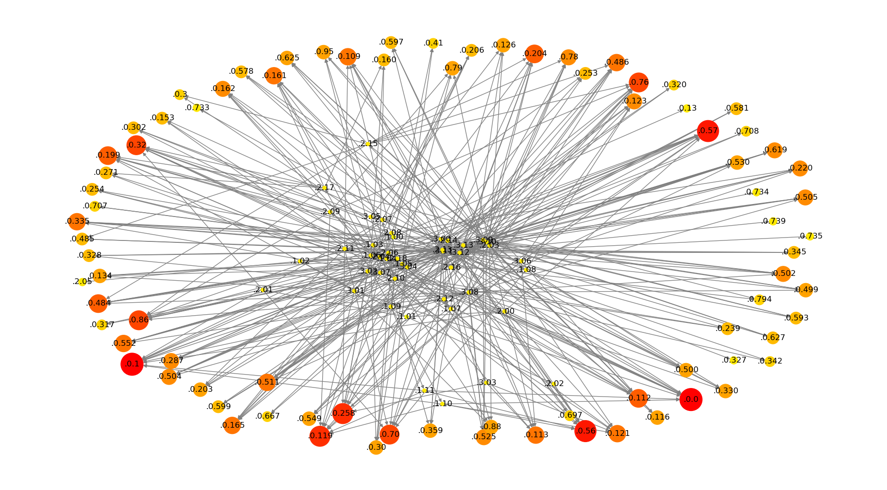
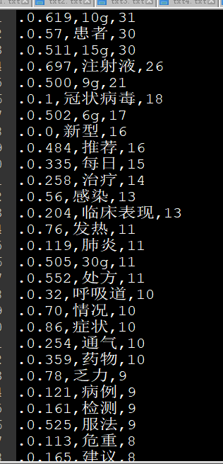

### 说明
基于新型冠状病毒感染的肺炎诊疗方案1-7版 关键词分析

比如id = .0.199的为正文关键词”影像学”, 其词频较大, 第六版正文中一共出现过7次 所以比较红,结点也比较大.
其在标题为 “临床特点” 的  .1.02’出现过, 并且 还能根据边缘发现这个词还曾在id = .2.17,解除隔离和出院标准 和 .id = 2.09,
普通型的标题下面分别出现过

下图为id - word- 词频数表

### using
seg2word.py 将格式化的文档正文分词
draw.py 将图画出

